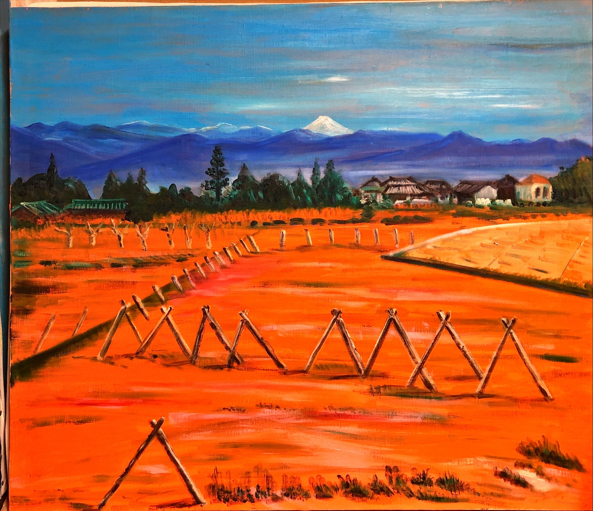
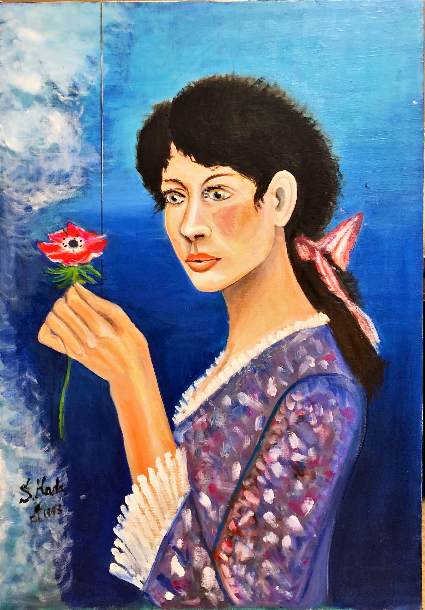
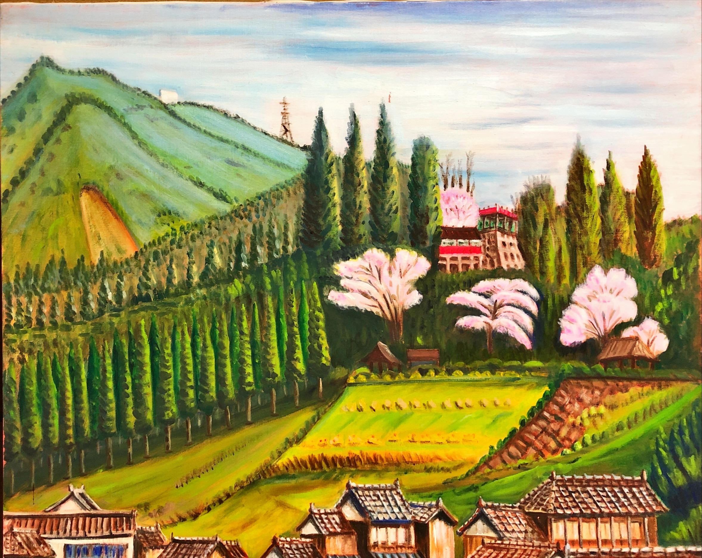

# Father-s_Pic

<html>
<head>

<meta charset="UTF-8">
<meta http-equiv="Content-Type" content="text/html; charset=UTF-8">
<meta http-equiv="X-UA-Compatible" content="IE=EmulateIE10" />
<meta http-equiv="X-UA-Compatible" content="IE=edge">

<!--ここから上はお決まりの定型文です-->

<!--ここからが表現の書式などを決めるcssという部分-->

<link href="https://cdnjs.cloudflare.com/ajax/libs/lightbox2/2.7.1/css/lightbox.css" rel="stylesheet">

</head>

<body>

  モバイル端末をお使いの場合は、画面を横向きにすると
  より見やすくご覧頂けます。

 アクセス用QRコード

    
<!--ここまでは定型文としてそのままコピペして再利用します-->
    
<h1><marquee behavior="left">!!! 2023年4月15日、飯能市井上の別宅に眠る父の絵画を画像キャプチャー!!!</marquee></h1>
    
                         
	
<h1>掲載概要</h1>

 
<h1>父、羽田 忍が生前に描いた絵画を画像キャプチャー。 
2006年6月2日の命日から17年余りを経過していますが、 
残された絵画の色は褪せていませんでした。</h1>

	
	
                         
                          
	
<h2>2023/04/15, 父の作品を一気に画像キャプチャー。</h2>

<h2>作品の色は未だ鮮やかです。</h2>

 
<iframe width="560" height="315" src="https://www.youtube.com/embed/HiS5SZgmNLo" title="YouTube video player" frameborder="0" allow="accelerometer; autoplay; clipboard-write; encrypted-media; gyroscope; picture-in-picture; web-share" allowfullscreen></iframe>
	
<!--
<iframe width="560" height="315" src="https://youtube.com/shorts/uXd21wT0jJ4?feature=share" title="YouTube video player" frameborder="0" allow="accelerometer; autoplay; clipboard-write; encrypted-media; gyroscope; picture-in-picture; web-share" allowfullscreen></iframe>
-->
 

                         
                          

<footer>
    <h2>Copyright S.Hada 2023</h2>
</footer>
    
<!--HPにさまざまなJavaScriptを呼び込むための書式-->

</body>

</html>
